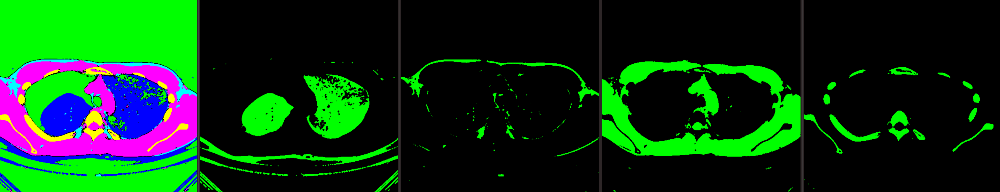

# vlung

CT画像データを解析し、各部位ごとのOBJファイルを生成するソフトウェア

<div style="text-align: center">
  
</div>

## インストール方法

### 必要なソフトウェア

 - [Rust](https://www.rust-lang.org/)

### インストール方法

Rustの管理ツールであるCargoを[公式サイトのインストールページ](https://www.rust-lang.org/tools/install)に従ってインストールしてください。

次にcargoを用いてインストールします。

```sh
cargo install vlung-analysis
```

最新版を使いたい場合はリポジトリを手元にcloneしてからインストをします。

```sh
git clone https://github.com/puripuri2100/vlung-analysis.git
cargo install --path vlung-analysis
```

## 使い方

引数がいくつかあります。詳しくは

```rust
vlung-analysis --help
```

を行ってください。

### 必須引数

- `-f`, `--folder`：CTファイルのあるフォルダへのパス
- `-o`, `--output`：生成するファイルへのパス

### オプション引数

- `-d`, `--depth-img`：肺の断面画像をその場に生成します。そのときの断面の深さを与えます
- `-s`, `--start-range`：解析範囲を直方体の大きさに制限することができます。そのときの始点の座標です。
- `-e`, `--end-range`：解析範囲を直方体の大きさに制限することができます。そのときの終点の座標です。
- `-n`, `--noise-removal`：ノイズ除去をするときの回数です。数が大きくなればなるほどノイズが除去されますが、必要な部分も消える可能性があります。
- `-i`, `--init-colors`：部位を分割する際の基準値を与えることができます。

## CT画像データの取得方法

自分自身のCT画像データを持っている方は少ないと思うので、試しに使ってみたい方はCC0ライセンスのもとで自分が後悔している気胸時の肺のCT画像データを使ってみてください：<https://github.com/puripuri2100/lung>

自分自身のCT画像データを取得してみたい方は撮影された病院の制度を利用して入手してみてください。例えば筑波大学附属病院では「診療記録等の開示」という制度が用意されています。：<https://www.hosp.tsukuba.ac.jp/outpatient/outpatient/release.html>

---

[The MIT License](https://github.com/puripuri2100/vlung-analysis/blob/master/LICENSE)

Copyright (c) 2024 Naoki Kaneko (a.k.a. "puripuri2100")

